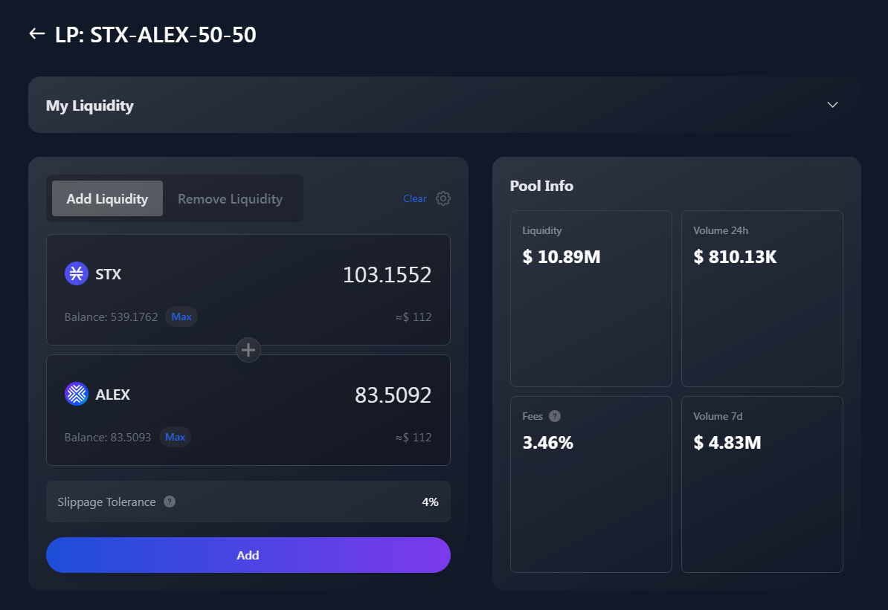

# 🐋 Liquidity Pools

## Getting Started

### What are Liquidity Pools?

Liquidity pools are crowdfunded collections of crypto assets held in a smart contract, designed to provide liquidity for decentralized exchanges (DEXs) and support various decentralized finance (DeFi) protocols.

While their applications range from lending and borrowing platforms to algorithmic protocols for stablecoins, their primary use is on DEXs. Liquidity pools enable users to trade crypto assets without the need for a centralized intermediary, serving as reserves of assets that users can trade against.

### Their role in Automated Market Makers (AMMs)

Automated Market Makers (AMMs) are the predominant type of decentralized exchange (DEX). While other DEX designs exist, AMM-based DEXs have become extremely popular. AMMs operate via liquidity pools and utilize algorithmic mechanisms to determine prices and facilitate the trading of crypto assets between peers.

Smart contracts manage all trades executed within the AMM, eliminating the need for direct counterparties, unlike in traditional order book trading. Here, liquidity pools act as the counterparties, providing instant liquidity when needed.

### ALEX Liquidity Pools

The ALEX decentralized exchange protocol is AMM-based and consists of a set of smart contracts built on the Stacks network. Each liquidity pool represents a collection of funds locked into a smart contract by voluntary depositors.

The users who deposit their assets into the pools are known as liquidity providers (LPs). To incentivize liquidity providers, the ALEX AMM protocol rewards them with a fraction of the trading fees generated on the AMM. Users can easily become liquidity providers by following simple steps; see the Provide Liquidity section for more details.

Each liquidity pool contains a specific pair of cryptocurrencies for users to trade against with. For instance, a user looking to trade Stacks' native currency (STX) for ALEX's governance token (ALEX) will interact with the STX/ALEX liquidity pool on ALEX's smart contract. Performing a swap between two assets within ALEX Lab platform is very easy; go and check Swap section for more information.

### Liquidity Providers (LPs)

In exchange for providing cryptoassets, LPs receive an amount of LP tokens that represent their share of assets within the pool. LP token holders earn a proportional share of all transaction fees charged to traders that use the pool. These tokens can also be stacked/locked to earn rewards: this is know as Yield Farming; check the Farm section for further details.

## Provide Liquidity

You can become a liquidity provider by submitting two tokens to the liquidity pool to begin earning a share of the trading fees.

The trading fee rebate is 0.3% per transaction of which 50% goes to Liquidity Providers and 50% goes to the platform.

_Example:_

- _Let’s assume you want to become a Liquidity Provider for STX/ALEX pool, assuming each has a $1 value so you add liquidity of 10 ALEX and 10 STX receive 10 LP tokens._
- _The 10 LP tokens represent a value of $20 (ALEX $10 & 10 STX $10)._
- _For each trade within the pool, the pool gets 0.3% per transaction_

You can remove your liquidity at anytime. If you are interested in receiving significantly higher returns as a liquidity provider however, you can chose yield farming which means you stake or lock up your LP tokens for a fixed amount of time to earn yield rewards. You will then receive trading fees as well as ALEX platform incentive tokens. When yield farming however, you can not remove your LP tokens until the staking period you selected ends.

